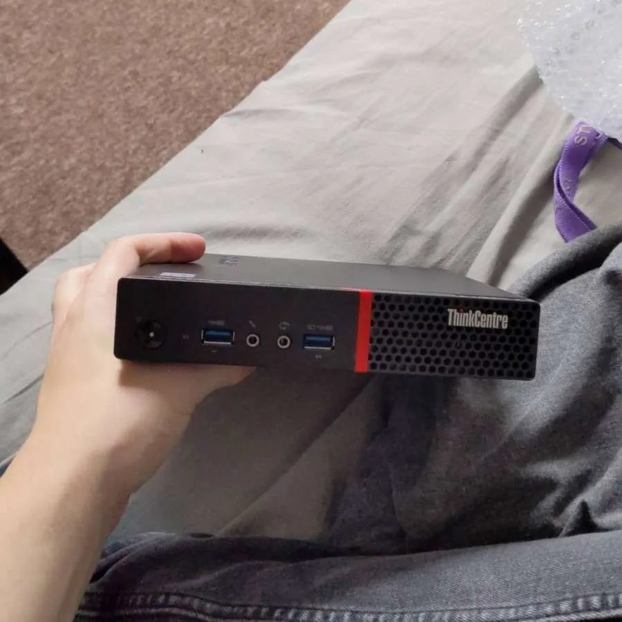
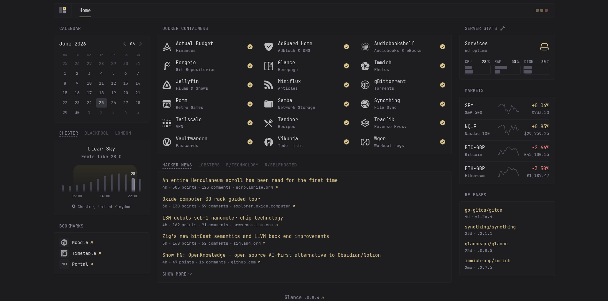

# barry.

Barry is my first homelab, written in docker compose for a single-node setup.

## Software

I like my server to be entirely reproducible, meaning I can just move my setup to a different physical computer and have it perform identically. While NixOS was tempting for this project, the poor documentation and lack of official software ports put me off. In the interest of picking up industry skills and containerisation, I’ve used Docker Compose for any and all user-facing software. Other notable parts of the stack include:

- **Debian** as the OS - The server should be as “set it and forget it” as possible, and Debian is the Linux distribution most aligned with that goal.
- **Traefik** as the reverse proxy - I decided against nginx because it added an extra config file and a GUI to keep track of. Traefik is probably overkill, but I prefer my software to have a steep upfront time cost if it means less long-term maintenance.
- **AdGuard Home** for DNS - The name of the project probably undersells it's capabilities, as self-hosting your own DNS server allows you to fileter out *any* content you don't want to see on the web by intercepting network requests to undesirable domains. I personally tell my DNS server to route all traffic from my sub-domains (`*.richard-hughes.dev` as of writing) back to the server’s IP address. That way, a container can be given a human-readable address like `jellyfin.richard-hughes.dev` and support HTTPS. This is particularly important for my password manager and budgeting app, which refuse to serve over HTTP.
- **Name.com** for my domain - This was part of GitHub’s student developer pack, and I’ll probably move to a registrar with stronger API support and pricing before renewal.
- **Tailscale** for remote access - I was pleasantly surprised to find that a VPN was one of the easiest services to self-host. It's as easy as signing in with an OAuth provider and pressing "Connect".
- **Glance** for a simple home page - Like Traefik, Glance lets me set labels on my containers to declare names, icons, categories, and more for (usually) single-file setups.
- **Syncthing** for file sync - Self-Explanatory. The mobile situation is a bit rocky, but for whatever reason, there isn’t much software that just syncs files between devices without a centralised cloud storage model.
- All other containers are frontends for my documents and media.

## Setup

Copy `example.env` to `.env` and fill out the details. Then, run `docker compose up`. You can probably figure out the steps before that based on your choice of distro.